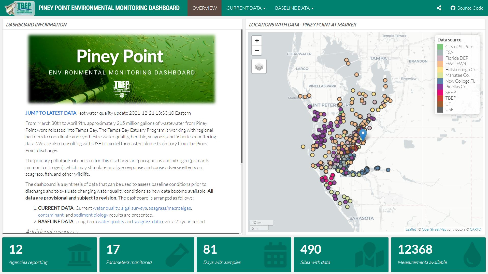

```{r setup, echo = F, warning = F, message = F, results = 'hide'}
# figure path, chunk options
knitr::opts_chunk$set(fig.path = 'figs/', warning = F, message = F, echo = F, cache = F, dev.args = list(family = 'serif'), dpi = 300, warning = F)

box::use(
  here[here],
  dplyr[...],
  tidyr[fill],
  english[english], 
  tibble[deframe]
)

data(efftab)
data(demtab)
data(dashusr)
data(dashdem)
data(rsallpts)

grps <- c('City of St. Petersburg', 'Environmental Science Associates', 'Florida Department of Environmental Protection', 'Fish and Wildlife Commission, Fisheries and Wildlife Research Institute (FWC-FWRI)', 'Hillsborough Co.', 'Manatee Co.', 'New College of Florida', 'Pinellas Co.', 'Sarasota Bay Estuary Program (SBEP)', 'Tampa Bay Estuary Program (TBEP)', 'University of Florida', 'University of South Florida')
```

`r paste('Last manuscript build', Sys.time())`

```{r echo = F, cache = F, eval = F}
spelling::spell_check_files(here::here('manu-draft.Rmd'))
```

\newpage

# Introduction

* Piney Point background
* Monitoring response
* Challenges with data synthesis and need for rapid assessment tools, TBEP commitment to OS

This paper describes the data synthesis tools that were used to inform partner response and public awareness of the 2021 Piney Point release into Tampa Bay, Florida.  We focus specifically on the open science methods and products that were created to organize, contextualize, and communicate these data, including the Piney Point environmental monitoring dashboard developed by the Tampa Bay Estuary Program to rapidly deliver results for data collected in near real-time.  A discussion of the technical and philosophical challenges of synthesizing data from multiple disparate sources, as well as the lessons learned, is also provided to inform future response-based monitoring efforts.  

# Data collection and synthesis 

Monitoring of bay resources in response to release from Piney Point began in late March of 2021 and continued through the summer and early fall.  Several partners from public, private, and academic institutions conducted monitoring of water quality, phytoplankton (including the red tide organism *Karenia brevis*), seagrasses, macroalgae, and benthic habitats (Figure \@ref(fig:map)).  Monitoring partners included the Florida Department of Environmental Protection (FDEP), Environmental Protection Commission (EPC) of Hillsborough County, Parks and Natural Resources Department of Manatee County, Pinellas County Division of Environmental Management, Fish and Wildlife Research Institute (FWRI) of the Florida Fish and Wildlife Conservation Commission (FWC), City of St. Petersburg, Tampa Bay Estuary Program (TBEP), Sarasota Bay Estuary Program, Environmental Science Associates, University of South Florida, University of Florida, and New College of Florida (Figure \@ref(fig:map)a).  Coordination among monitoring agencies was facilitated by the TBEP and under guidance of a plume simulation model run by the Ocean Circulation Lab at the University of South Florida (USF), College of Marine Science [@Chen18;@Chen19]. Initial monitoring was focused near the release site at Port Manatee (Figure \@ref(fig:map)), but later expanded throughout middle and lower Tampa Bay, Boca Ciega Bay, Manatee River, and Sarasota Bay as the simulation model predicted dispersal of the plume away from Piney Point [@Liu21].  Sampling effort was most intense in April, with less frequent sampling from May through September, although seagrass and macroalgae sampling was consistent throughout the study period (Table \@ref(tab:efftab)).  

Water quality monitoring focused on parameters that were expected to indicate a response to elevated nutrient loads from the Piney Point release.  Because Tampa Bay is a nitrogen-limited estuary [@Greening14;@Greening06;@Wang99], water quality samples were taken for total nitrogen and inorganic forms (i.e., total ammonia nitrogen, nitrate/nitrite), chlorophyll-a as an indication of phytoplankton growth, and additional parameters expected to respond to nutrient loading (e.g., secchi depth, dissolved oxygen).  Phytoplankton monitoring included both qualitative (presence/absence) and quantitative (cells/L) summaries of taxa enumerated by microscopy from water samples taken at similar frequency and distribution as the water quality sites.  Phytoplankton data also included event-based sampling for *Karenia brevis*.  Finally, seagrass and macroalgae data were collected by transect sampling at locations covering the shoreline north of Piney Point and extending to the south into northern Sarasota Bay (Figure \@ref(fig:map)b). Transect sampling included identification of seagrass species and macroalgae, typically to genus, and Braun-Blanquet abundance estimates at 10 m distances along each 50 m transect.  Details on all sampling methods are provided in @Beck22. 

The synthesis of data from multiple partners included several challenges that TBEP staff addressed by employing open science principles within the time and resource limitations of the event.  First, a centralized location for sharing data on Google Drive was required for the synthesis effort (Figure \@ref(fig:synthesis), file drops).  Partner agencies were requested to voluntarily upload their data to a publicly accessible folders, or share via email with TBEP staff for upload if access issues to the main drive were encountered. Datasets were also downloaded by TBEP staff from source (e.g., FDEP, https://floridadep.gov/dear/dear/content/tampa-bay-sampling-response-and-results) and uploaded to the Google Drive.  Using more formal data hosting services that include full metadata documentation was not possible while monitoring was ongoing given the volume and variety of data collected by partners.  As such, Google Drive was a useful interim solution that provided 1) online sharing of data in different formats in a familiar file-based organization, and 2) an entry point for downstream data synthesis products created by TBEP. Changing user permissions also allowed read/write access to only those necessary (i.e., partner agencies for data upload), while allowing a read only option for all files so that source data were publicly available to view as needed.  

A second synthesis challenge was unifying the multiple data types hosted on Google Drive into a usable format for the dashboard and additional analyses (Figure \@ref(fig:synthesis), data synthesis).  Several folders on Google Drive were created that included relevant files for each type of monitoring data (e.g., water quality, phytoplankton, etc.).  Each folder typically contained dozens of files saved as Google Sheets, often uploaded as a single sampling event by an individual monitoring agency.  For example, the folder for the water quality sampling included 91 separate files.  Extensive data "wrangling" was required to combine the files into a tidy format [@Wickham14c] and a custom processing script was created by TBEP using the open source R Statistical Programming Language [@RCT20]. An RStudio project was created with full version control that included a single script, `dat_proc.R`, that imported all files from Google Drive for synthesis into individual binary \.RData files for use with the dashboard (i.e., individual file for water quality, phytoplankton, etc.).  Several R packages were indispensable in the data synthesis effort and these included 1) the dplyr, tidyr, lubridate, and readxl packages included with the tidyverse suite of packages [@Wickham19], and 2) the googlesheets4 [@Bryan20] and googledrive [@DAgostino20] R packages for connecting and downloading files from Google Drive.  Importantly, all source files were kept on Google Drive and were unaltered from their original format to isolate the original data from any downstream analysis. 

Combining the source files on Google Drive into a synthesized format in R also required a consistent set of variables and naming conventions that were applied to each file.  For example, parameters included in each water quality file were converted to a common set of names and all units were standardized to commonly used values (e.g., total nitrogen as `tn` and mg/L, chlorophyll-a as `chla` and $\mu$g/L, etc.). This required developing custom processing code for data files from each partner to address each unique use case.  As a result, the final processing file included almost 3000 lines of code to create the synthesized data products.  Each partner agency was also assigned a unique identifier in the synthesized files so effort could be tracked and reported in the dashboard (e.g., Pinellas County as `pinco`, Florida Department of Environmental Protection as `fldep`, etc.).  All synthesized files were saved in a long and tidy format, where each observation was given its own row, each variable was in its own column, and only one value was assigned to a cell [@Wickham14c].  This allowed for easily filtering observations of interest (as required with the dashboard) using the standardized naming conventions applied to each source file. More importantly, the developed workflow was used iteratively, often several times each week as new data files were uploaded to the Drive folders.  This required executing the synthesis code locally and often making edits to the code to address new data formats or issues encountered when new files were uploaded.

The local workflow created by TBEP was hosted online in a GitHub repository [https://github.com/tbep-tech/piney-point, @Beck21d] that allowed use of additional resources that were critical to the synthesis effort (Figure \@ref(fig:synthesis), testing and sharing).  Hosting the RStudio project on GitHub served multiple purposes of 1) using version control to document and track changes using Git, 2) making the code publicly accessible for transparency with the larger research and management community, 3) allowing automated testing of repository content, and 4) serving as an access point for deploying the dashboard on Shiny Server (see below).  The use of automated testing was an important service to identify potential errors or mistakes in the synthesized datasets. The testthat R package [@Wickham11] was used to write several checks for each dataset that were considered essential for maintaining integrity of the information.  Each time changes were made to the repository and pushed to GitHub, tests were run automatically with GitHub Actions to verify each dataset included appropriate and accurate results.  For example, a test was used to verify that all water quality parameters were appropriately named and did not include any missing values. A notification was sent via email to TBEP staff if an error was encountered.  This automated service reduced the amount of time required to manually check the data and provided assurance that the reported results in the dashboard were correct. 

# The Piney Point Dashboard

## Setup

The Piney Point environmental monitoring dashboard was created to communicate the results from the synthesized datasets [Figure \@ref(fig:dashboard), @Beck21c].  The dashboard was developed "on the fly" as data became available and the synthesis workflow described in the previous section was used to update input datasets during the course of the 2021 monitoring effort.  All code used to synthesize the datasets from Google Drive and the code used to create the dashboard were contained in the same repository, allowing the workflow in Figure \@ref(fig:synthesis) to be used iteratively to update the content.  The dashboard was created using the shiny [@Chang21] and flexdashboard [@Iannone20] R packages to create the server and user interface components of the app. The flexdashboard package was particularly useful in creating an intuitive user interface to organize related components of the monitoring effort. The dashboard was deployed using Shiny Server by pulling the GitHub repository to a remote server maintained by TBEP each time an update was made (Figure \@ref(fig:synthesis), app deployment).  This allowed anyone to access the dashboard using the url https://shiny.tbep.org/piney-point.    

```{r}
# dashboard code breakdown
nlns <- 2346
setlns <- 346
rctlns <- 1319
uilns <- nlns - (setlns + rctlns)
srvlns <- setlns + rctlns
setpr <- paste0(round(100 * setlns / nlns, 0), '%')
rctpr <- paste0(round(100 * rctlns / nlns, 0), '%')
uipr <- paste0(round(100 * uilns / nlns, 0), '%')
srvpr <- paste0(round(100 * srvlns / nlns, 0), '%')
```

Both the server and user interface (UI) components of the dashboard were included in a single R Markdown [@Xie20] file totaling `r nlns` lines of code, with `r srvpr` and `r uipr` of the code dedicated to the server and UI, respectively.  The server components of the dashboard included a setup component (`r setlns` lines, `r setpr` of the total) and reactive component (`r rctlns`, `r rctpr` of the total).  The setup imported all R package dependencies (15 total), the synthesized input data from Google Drive (20 \.RData files), an R script with custom functions to summarize or plot the results, five log files, and various "static" objects used in other parts of the dashboard that did not depend on user inputs. The rest of the server included thirty-one reactive objects (`r rctlns` lines, `r rctpr` of the total) that received different user inputs and returned a shiny data object sent back to the user interface.  The imported log files were created during the data synthesis steps external to the dashboard and were specific to each data type (e.g., water quality, phytoplankton, etc.).  Each log file was used to display when a data type was last changed, to inform users when updates were made to the input data.  

The remainder of the R Markdown file was used to create the UI or the dashboard (`r uilns` lines, `r uipr` of total).  The flexdashboard package rendered with R Markdown was used to place shiny content in specific CSS elements, such as boxes or tabs that are scaled automatically to a user's browser, to create a UI with easily navigable content.  Specifically, the UI code organized the dashboard content into 1) a landing page when a user first accesses the website (Figure \@ref(fig:dashboard)), 2) tabs for navigating to current results for data from a specific monitoring type, and 3) tabs for viewing historical baseline data for comparison with the response-based monitoring data.  The landing page included a text overview of the dashboard, a map showing the monitoring locations, and several summary boxes at the bottom showing current effort to date (e.g., number of sites sampled, total days sampling, etc., Figure \). Each tab for the current data was organized specifically for each monitoring data type, although common elements included maps and tabular summaries where the displayed data could be chosen by date ranges or selected parameters.  Finally, the baseline data tab displayed long-term monitoring data for water quality and seagrass to provide a comparison with the response-based monitoring data.

An important service provided by the dashboard was creating context for the response-based monitoring results relative to baseline conditions in Tampa Bay.  This allowed dashboard users to quickly assess if the 2021 conditions were abnormal relative to typical seasonal patterns observed in the bay.  In addition to the baseline data tabs, all water quality data from the response-based monitoring were compared to the long-term monthly averages for data at the nearest ambient monitoring station [@Beck22].  Elements of the UI and summary plots allowed a user to quickly determine if the results were outside of the expected range.  Specifically, map points for a sampling event were displayed with a solid outline if results were out of range and without an outline if within the normal range.  A user could also click on an individual map point to view a time series of the 2021 data for the selected location that included upper and lower limits for the long-term monthly averages.  This functionality required additional modifications to the UI, in addition to developing custom code in the synthesis workflow that summarized the normal ranges prior to uploading data to the dashboard.  Ultimately, these changes improved the quality of information provided by the response-based monitoring by leveraging the decades of long-term monitoring data available for the bay.      

## Analytics

```{r}
totusr <- dashusr %>% 
  select(-Date) %>% 
  rowSums() %>% 
  sum() %>% 
  formatC(format = 'd', big.mark = ',')
demsum <- dashdem %>% 
  group_by(Group) %>% 
  summarise(
    tot = formatC(n(), format = 'd', big.mark = ',')
  ) %>% 
  tibble::deframe()
```

In addition to providing a centralized location for viewing results of the 2021 monitoring, the TBEP also had a need to understand how the broader community was engaging with the dashboard content. The Google Analytics service was used to track the number of users over time, their approximate location, how long a user engaged with the dashboard, and how the dashboard was accessed.  From May 13th through September, `r totusr` users visited the dashboard, representing `r demsum['City']` cities, `r demsum['State']` states, and `r demsum['Country']` countries (Table \@ref(tab:demtab)).  Understandably, most users were local, with the state of Florida accounting for a majority of visits.  An average of one minute and 21 seconds was spent on the dashboard by each user, although this time varied throughout the summer, with about an even split of users accessing through a mobile device or a web browser on a PC. The number of users also varied over time, with the highest number of visits in July (Figure \@ref(fig:analytics)a), which corresponded to severe red tide conditions and observable fish kills in densely populated areas of the bay [@Beck22].  Most users accessed the website through referrals from other websites (e.g., Figure \@ref(fig:analytics)b), although a substantial amount of visitors also accessed the dashboard directly (e.g., bookmarks or entering the URL in a web browser) or through email links.  Accessing the dashboard through social media or organically through a search engine was less common.  Trends in how users accessed the dashboard did not appear to change over time.    

# Data Archive

* Rationale, maybe make relative to past PP events (no data) and highlight importance of metadata
* Workflow and GitHub repository
* EML, KNB location, download stats

# Discussion

* Added value of the app
    * analytics speak for themselves, but not the whole picture.  How did users get to our dashboard (some of this info is in Analytics, but which of our comms products drove the bus)? How was it used (e.g., screenshots for pres, K. Hubbard pers. comm.)?
    * how can we better assess the value of these tools more holistically? What is the true measure of success in terms of behavior change or driving policy, if any? 
* Relevant considerations
    * What worked - use of OS tools, but still very time-consuming (e.g., R/dat_proc.R is thousands of lines of code)
    * Need for unified datasets, use of tidy principles, etc. Also mention that this relied on partners sending us data/putting data on GDrive, not everyone did that (note issues with the latter, i.e., access from elsewhere can be unreliable, but we also didn't have all the data).  Highly value of partnerships - data collection and sharing.
    * Value of historical data and contextualized summaries
    * Exposure of additional data needs (e.g., macroalgae)
* Future of Piney Point, next steps, etc.

\newpage

# Figures

```{r map, fig.cap = paste0('Response-based monitoring effort near Piney Point from March through September 2021 with (a) effort by monitoring group and (b) monitoring data type.  Monitoring groups included ', knitr::combine_words(grps), '. Monitoring data included algae sampling, seagrass and macroalgae, water quality (field-based and laboratory samples), and mixed monitoring (algae, seagrass and macroalgae, water quality). Inset shows location of Tampa Bay on the Gulf coast of Florida, USA.')}
knitr::include_graphics(here('figs/map.jpeg'))
```

```{r synthesis, fig.cap = 'Data synthesis workflow for Piney Point data.  Raw data were uploaded by partners to Google Drive, data were synthesized using R-based tools, data and dashboard code were uploaded in a unified format on GitHub that included automated testing, and then the app was deployed using Shiny Server.'}
knitr::include_graphics(here('figs/synthesis.JPG'))
```

```{r dashboard, fig.cap = 'Landing page for the Piney Point dashboard. Users can view a summary of effort to date and access additional tabs to view specific datasets.'}

```

```{r analytics, fig.cap = 'Piney Point dashboard (a) users by day and (b) cumulative users by source.  Source refers to how users accessed the dashboard (e.g., direct URL to the dashboard, email links, etc.).  Analytics were included in the dashboard beginning on May 13th, 2021.'}
knitr::include_graphics(here('figs/analytics.jpeg'))
```

\newpage

# Tables

```{r efftab}
cap.val <- 'Sampling effort for response-based monitoring by partners from April 1st 2021 through September.  Values show the total number of unique sites samples for water quality, algae (phytoplankton), and seagrass/macroalgae in Tampa Bay.  Values in parentheses show the percentage of the total for each monitoring type.'
knitr::kable(efftab, booktabs = T, caption = cap.val)
```

```{r demtab}
cap.val <- 'Top ten locations of users by city, state, and country for the Piney Point dashboard.  Numbers show the total users and percentages from the total for all locations.  Total cities, states, and countries that accessed the dashboard are shown in the column headers in parentheses.  Summaries are from May 13th, 2021 when analytics were included in the dashboard to October 1st, 2021.'
knitr::kable(demtab, booktabs = T, caption = cap.val)
```

\newpage

# References
